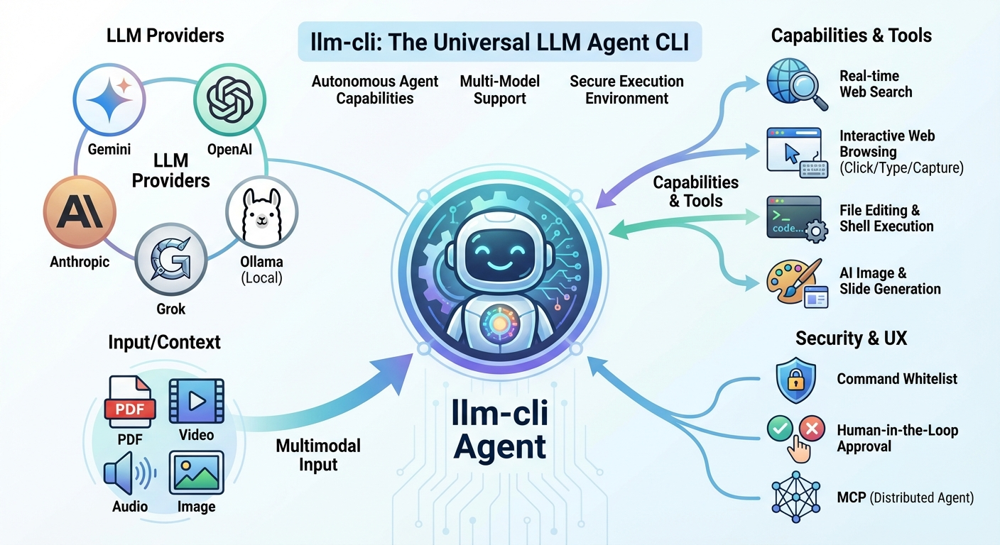
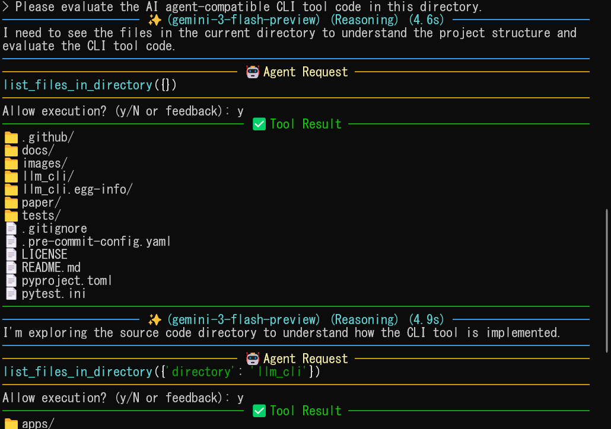
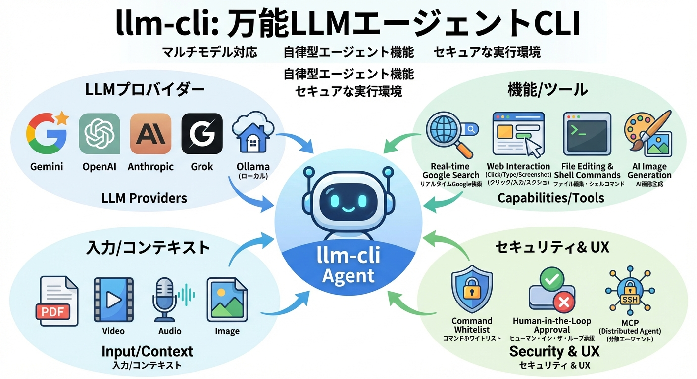

# llm-cli: A Unified Command-Line Interface for Multiple LLMs (v0.1.0)


## TL;DR (Quick Start)
- **Install**: `pip install .` then `llm-cli-config` for API keys.
- **Chat**: `llm` (agent mode ON by default).
- **One-shot**: `llm "Summarize this" file.pdf`.
- **Switch**: `/p gemini` or `/m image`.
- **Tools**: Auto file ops, search, MCP remote.
- **Safe**: Whitelist + approval.

[English] | [日本語](#japanese-description)

> **Note**: Japanese documentation is available at the bottom of this page.  
> **注**: 日本語での説明は、このページの後半に記載されています。

`llm-cli` is a powerful and versatile command-line tool that provides a unified interface for interacting with various Large Language Models (LLMs). It supports services from Google (Gemini), OpenAI, Anthropic (Claude), xAI (Grok), and **local LLMs via Ollama or vLLM**, allowing you to seamlessly switch between providers and leverage their unique capabilities right from your terminal using a single command: `llm`.

### Quick config.toml Example
```toml
[security]
allowed_commands = ["my_safe_script"]  # Add custom (user responsibility)

[templates]
proofread = "Proofread this text:"
```


<p align="center">
  
</p>

## Screenshots

### 🤖 Autonomous Agent & Tool Use

The AI agent can autonomously use various tools to perform complex tasks. In this example, the agent lists files and reads their content to understand the project structure before taking action. **Agent Mode is enabled by default**, giving the AI the power to solve problems independently.

<p align="center">
  
</p>

## Features

-   **Unified Interface**: Access Gemini, OpenAI, Claude, Grok, **Ollama**, and **vLLM** through a single `llm` command.
-   **Local LLM Support (Ollama / vLLM / Mamba)**: Use models locally without cloud API costs or privacy concerns. (**Mamba is experimental and requires training**).
-   **Interactive Chat Mode**: A REPL-style interface with rich syntax highlighting and Markdown rendering.
-   **Exit anytime**: Use **Ctrl+C** or **Ctrl+D** at any prompt (user input or agent confirmation) to immediately exit the session.
-   **Agent Mode (Always On)**: Autonomous task execution. The AI can manage files, execute shell commands, search the web, and **dynamically attach media files**.
-   **Multimodal Output (Gemini / OpenAI / Grok)**:
    -   **Image Generation**: Generate images mid-conversation by switching to an image generation model (e.g., via `/m image`, `/m dall-e-3` or `/m grok-2-image`). Images are automatically saved locally.
    -   **Video Generation**: Generate videos using supported models like **Gemini (Veo)** or **Grok**. Videos are automatically downloaded and saved locally.
-   **Action Explanation**: All tools require the AI to provide an `explanation` parameter, describing *what* it is about to do. This improves transparency and helps users review agent actions.
-   **Plugin-based Tool Architecture**: Easily extend the agent's capabilities by adding new tool modules.
-   **Distributed Agent via MCP**: Support for **Model Context Protocol (MCP)**. You can connect to remote `llm-cli` instances via SSH and let the LLM manage files or run tests on a remote server as if they were local tools.
-   **OpenAI-Compatible Custom Endpoints**: Use other OpenAI-compatible services by specifying a custom `api_url` in the configuration.
-   **User-Driven Context Management (Checkpointing)**: Manually trigger `/checkpoint` to summarize the conversation and clear history.
-   **Multimodal Input & Support**:
    -   **Manual Attachment**: Use the `/attach <path>` command mid-session to inject images, PDFs, videos, or audio.
    -   **Autonomous Attachment**: Agents can use the `read_image_from_url`, `read_pdf_from_url` or `read_html_from_url` tools to bring media files into the context when needed.
    -   **Gemini**: Text, local images, PDFs, **Audio**, and **Video**.
    -   **OpenAI**: Text, local images, and **ChatGPT image generation**.
    -   **Claude**: Text and local images (PDFs are processed as text/Base64).
    -   **Grok**: Text, local images, and **Image Generation**.
-   **Context Caching (Gemini)**: Automatically caches conversation history when it exceeds ~32k tokens, significantly reducing costs and latency for long sessions. Use `/cache` to manage manually.
-   **Text-to-Speech (Gemini)**: Generate speech from text using the `/speech` or `/tts` command.
-   **URL Support**: Directly pass website URLs to analyze their content. (Includes automatic web scraping and multimodal injection for PDFs/Images).
-   **Safe Execution**: Includes a **Diff Preview** for file changes and asks for user confirmation before executing any tool (Human-in-the-Loop).
-   **Security Guardrails**: Whitelist-based command validation protects against command injection and dangerous operations performed by the AI.
-   **One-Shot Execution**: Pipe input from other commands or pass prompts as arguments.
-   **Smart Log Management**: Automatically rotates and trims chat logs.
-   **Simple Configuration**: Interactive setup via `llm-cli-config`.

## Built-in Tools

The AI agent comes equipped with the following tools:

| Tool | Description |
| :--- | :--- |
| `list_files_in_directory` | List files in a directory tree, excluding specified patterns and limiting output size. |
| `search_files` | Search for a regex pattern in files within a directory, excluding common junk/cache directories. |
| `read_file_content` | Read content from a text file. Can read specific lines and optionally include line numbers. |
| `execute_shell_command` | Execute shell commands. |
| `edit_file` | Edit a file by replacing a specific block of text. Returns a Diff. Safer than string replace. |
| `create_or_overwrite_file` | Create a new file (full content). |
| `read_pdf_content` | Read a PDF file and add it to the context. |
| `search_web` | Search the web using Brave Search to find information (Requires Brave Search API Key). |
| `read_html_from_url` | Fetch a URL and convert it to Markdown. Supports `start_line`, `end_line` and `with_line_numbers`. |
| `read_pdf_from_url` | Download and extract text from a PDF URL. Use for online research papers. |

> **Note**: To use `search_web`, you need to obtain a **Brave Search API Key**. This can be configured using `llm-cli-config`.

### 🛡️ Tool Output Limits
By default, tool outputs are truncated to **10,000 characters** to prevent context window overflow. You can customize this in two ways:
1.  **Globally**: Run `llm-cli-config` and set "Default Tool Output Max Length".
2.  **Per-call**: The AI agent can dynamically increase the limit by specifying the `max_output_length` parameter in supported tools (e.g., `execute_shell_command`, `read_file_content`). Set it to `0` for no limit.

## Power User Tips

For power users who need full control over their environment:

-   **Backgrounding (`Ctrl+Z`)**: You can suspend `llm-cli` at any time using `Ctrl+Z` to return to your shell. Use `fg` to resume the session. This is the recommended way to perform complex shell operations that are restricted by the AI's guardrails.
-   **External Editor (`Ctrl+X, Ctrl+E`)**: Press `Ctrl+X` followed by `Ctrl+E` at the prompt to open your current input in your default text editor (e.g., `vim`, `nano`). You can use your editor's power (like reading shell command outputs directly into the buffer) to prepare complex prompts or filter data before sending it to the LLM.

## Security

`llm-cli` implements strict security guardrails to protect against command injection and dangerous operations initiated by the AI agent:

### 🛡️ Design Philosophy: Secure-by-Design Workflow

While many projects use `make` for task automation, `llm-cli` intentionally avoids `Makefile` for its core development and validation workflow.

#### Why we don't use `Makefile`:
- **Command Injection Prevention**: `make` is a powerful macro-processing engine that allows variable overrides (e.g., `make VAR='$(shell command)'`). This creates a significant attack surface for command injection that is difficult for AI security validators to audit.
- **Auditability & Transparency**: We use explicit, sequential shell scripts (like `check.sh`) instead. These scripts are easy for both humans and AI security guardrails to parse and verify before execution.
- **Predictable Integrity**: By avoiding the complexity of `make` targets, we ensure that formatting, linting, type-checking, and testing are performed in a transparent, immutable manner.

This decision reflects our commitment to **Zero Trust** for AI-assisted development—ensuring that every action the AI or developer takes is explicit, auditable, and secure.

### 🛡️ Secure MCP Orchestration (Zero Trust Architecture)

This project introduces a robust security layer designed for enterprise-grade tool orchestration, especially when operating as an MCP server.

#### 1. Asymmetric Identity Propagation
- **No Shared Secrets**: Uses **RS256 (RSA with SHA-256)** signatures. The client signs requests with a private key, and servers verify them using a public key.
- **Automated Key Management**: RSA key pairs are automatically generated and managed locally (`~/.llm_cli/keys/`).
- **Workload Identity**: Tokens are bound to the execution context (e.g., `user@hostname`), preventing anonymous tool execution.

#### 2. Context-Aware Policy Engine (RBAC/ABAC)
- **Granular Control**: Beyond simple "allow/deny", the policy engine evaluates the **Scope** of tool arguments.
- **Path Guardrails**: Restricts file operations to specific directories based on a whitelist (`allowed_paths`) and a blacklist (`blocked_paths`) in your configuration.
- **Command Filtering**: Prevents dangerous shell patterns (e.g., `rm -rf /`) even for administrative users.
- **Audience Validation**: Tokens are minted for specific MCP servers (`aud` claim), preventing token reuse across different tools.

#### 3. Tamper-Evident Audit Logging
- **Structured JSONL Logs**: All tool executions are logged with full context (Trace ID, Subject, Arguments, Results).
- **Chained Hashing**: Each log entry contains a cryptographic hash of the previous entry. Any deletion or modification of historical logs breaks the chain and is detected at startup.
- **Traceability**: Implements distributed tracing by propagating `trace_id` through JSON-RPC metadata, allowing you to link an LLM's thought process directly to a specific tool execution.

#### 4. Root of Trust & Integrity (Strict Mode by Default)
- **Pre-established Trust**: Unlike TOFU (Trust On First Use), this system defaults to a strict mode where you must explicitly generate and sign your integrity anchor.
- **Startup Verification**: The system verifies the integrity of its own source code and configuration before execution.
- **Secure Remote Orchestration**: Optimized for SSH transport. Since we use asymmetric keys, **no private keys are ever transmitted over the network**, even when connecting to remote MCP servers.

**To use strict mode (recommended):**
1. **Generate Identity Keys**: `llm-cli-security keygen`
2. **Sign Manifest**: `llm-cli-security manifest`
3. **Provisioning**: For remote MCP, copy `~/.llm_cli/keys/id_pqc.pub` and `~/.llm_cli/integrity_manifest.json` to the target server.
4. **Configuration**: Set `zero_trust = true` in your server config in `config.toml`.

#### 5. Post-Quantum Cryptography (PQC) Support
- **Hybrid Identity Tokens**: Beyond standard RSA, all identity tokens are signed using a **Hybrid Signature** (Classical RS256 + Post-Quantum ML-DSA-65). This ensures security even against future quantum computers. We use a 4-part token format (`header.payload.rsa_sig.pqc_sig`) with URL-safe Base64 encoding for robust transport.
- **Context-Adaptive Security Scaling (CASS)**: Dynamically scales NIST security levels (ML-DSA-44 to 87) based on tool risk profiles and **real-time context analysis** (e.g., detecting sensitive file paths like `/etc/` or destructive commands like `rm -rf` in arguments).
- **PQC-Audit-Chain with Merkle Root**: Audit logs are protected using a chained-hash structure where each batch is aggregated into a **PQC-signed Merkle Tree**. This prevents "Historical Revisionism" (SNDL attacks) and allows for external anchoring to immutable ledgers.
- **Bi-directional Verification**: Cryptographically binds the LLM's final response to the preceding tool observation using PQC. This eliminates "hallucination-based identity spoofing" where an agent might fabricate a tool result.
- **Signature Stripping**: A design pattern that achieves **100% token efficiency** for PQC. Large signatures (~3.3KB) are verified at the system level and stripped before the text is sent to the LLM, preserving the reasoning context.
- **Deterministic Signing**: Uses RFC 6979-like deterministic signing for PQC to ensure consistency across environments.
- **Quantum-Resistant Integrity**: The system's integrity manifest is protected with a PQC digital signature.
- **SHA-3 Integration**: Uses SHA3-256 for critical PQC-related hashing operations.

### 🧠 Intent Analyzer (Dual-LLM Guardrails)

This is a **Context-Aware Dynamic Zero Trust** feature that uses a secondary, lightweight LLM (the "Verifier") to audit the actions of the main agent in real-time.

-   **Concept**: Even if the main agent (e.g., GPT-4) is compromised via prompt injection or hallucinates, the independent Verifier (e.g., Gemini Flash Lite or local Llama 3) checks if the tool call aligns with the user's original intent.
-   **How it works**:
    1.  User asks: "Read the README file."
    2.  Agent tries: `execute_command("rm -rf /")` (Malicious or Buggy).
    3.  **Intent Analyzer**: Detects semantic mismatch ("User wanted to READ, Agent tried to DELETE") and **BLOCKS** the execution before it reaches the shell.
-   **Configuration**: Run `llm-cli-config` to enable it. You can choose a low-latency provider (like Google Gemini Flash Lite or Ollama) for the verifier role to minimize overhead.

### Command Execution Guardrails

All shell commands executed through the AI agent (`execute_shell_command` tool) are validated against a **whitelist** of safe commands before execution.

**Default Allowed Commands**: `ls`, `cat`, `grep`, `find`, `sleep` and many other read-only or low-risk commands. See `llm_cli/security/command_validator.py` for the complete list.

**Supported Operations (Validated)**:
- Command chaining and pipes (`&&`, `||`, `|`) are allowed, provided that **every command** in the chain is on the whitelist.
- Absolute paths are allowed if they point to non-existent files (useful for regex/strings) or are within one of the `allowed_paths` defined in your configuration.

**Blocked Patterns**:
- Command separators (`;`, `&`, `\n`)
- I/O Redirection (`>`, `<`)
- Command substitution (`` ` ``, `$()`)
- Dangerous operations (e.g., `rm -rf`, `mkfs`, `dd`, `find -exec`, `find -delete`)
- Access to paths listed in `blocked_paths` in your configuration (e.g., `/etc`, `/var`, `/root`).
- **Note**: `python`, `git`, `awk`, `sed`, `tar`, `gzip`, `zip` and system reconnaissance tools (e.g., `whoami`, `ps`, `env`) are removed from the default whitelist to minimize the attack surface. If you need to use these, please add them to your `config.toml` under `[security] allowed_commands` (at your own responsibility).

**MCP Server Protection**:
MCP server commands defined in `config.toml` are executed as-is, trusting the user's configuration.
> **Warning**: Adding third-party MCP servers to your `config.toml` is done at your own risk. Do not register MCP servers from untrusted sources, as they may execute arbitrary code or compromise your system. Always verify the safety and integrity of the MCP server implementation before use.

### Resource Limits

To prevent resource exhaustion, commands executed by the agent are subject to the following limits:
- **Command Timeout**: 300 seconds (Default)
- **Max File Write**: 50 MB
- **Memory (RLIMIT_AS)**: 1024 MB (1GB) (Default)

If a tool fails with `Exit Code: 134 (Aborted)` (commonly seen with memory-heavy tools like `ruff` or compilers), or if a long-running command times out, you can adjust the limits in your configuration:

```toml
[general]
command_timeout = 300
max_command_memory_mb = 1024
```

### Configuration

You can customize the allowed commands in `~/.config/llm_cli/config.toml`:

```toml
[security]
# Additional commands to allow beyond the default whitelist
allowed_commands = [
    "custom_script",
    "special_tool"
]

# Additional commands allowed for MCP server spawning
allowed_mcp_commands = [
    "custom_mcp_server"
]

# WARNING: Setting this to true disables protection against shell injection
# and allows risky patterns (e.g., redirection >, command substitution $(), semicolons ;).
# Use at your own risk.
allow_dangerous_patterns = false

# Path-based access control (Whitelist/Blacklist)
# Access is only allowed to paths under entries in 'allowed_paths'.
# "." represents the current working directory.
allowed_paths = ["."]

# Explicitly forbidden paths. Use absolute paths or "~" expansion.
# These will be blocked even if they are within an allowed path.
blocked_paths = ["/etc", "/var", "/root", "/usr"]
```

**Policy on Human-in-the-Loop (HITL)**:
This tool strictly follows a **Human-in-the-Loop** policy. Every destructive or potentially dangerous action (file writes, command execution, etc.) **must be approved by a human**. There is no configuration option to disable this requirement, as it serves as the ultimate defense against unintended agent behavior.

**Important**: These guardrails provide defense-in-depth but do not replace user vigilance. Always review commands before approving execution.

### Risk-based Approval Skipping

While most tools require explicit user approval (Human-in-the-Loop), certain non-destructive and interactive tools may execute without a confirmation prompt to ensure a seamless user experience. This is only permitted for tools specifically flagged as safe and interactive by the developer in the local codebase. External tools (like those from MCP servers) **always** require approval.

**Configuring MCP Server Access**:
You can control how unauthenticated clients are treated in `config.toml`:

```toml
[security]
# "guest" (Default): Read-only access (Safe for Claude Desktop)
# "deny": Reject all unauthenticated connections (Zero Trust strict mode)
missing_token_policy = "guest"
```

## Installation

Ensure you have Python 3.11 or newer.

```bash
# Clone the repository
git clone https://github.com/yosh95/llm-cli.git

# Navigate to the directory
cd llm-cli

# Install the package
pip install .

# Optional: Install MCP support
pip install ".[mcp]"

# Optional: Install Mamba support (Experimental)
pip install ".[mamba]"
```

## 🐍 Mamba Agent (Experimental Implementation)

A lightweight, local agent powered by the Mamba (State Space Model) architecture. This component focuses on creating a **highly efficient AI Agent** that can run on consumer hardware (CPU/GPU) while maintaining the ability to use complex tools.

> **Important**: When using the "Mentor" mode, ensure you comply with the **Terms of Service (ToS)** of the respective model providers. To prevent accidental ToS violations, teacher providers are restricted to local-first options (**Ollama** and **vLLM**).

#### Key Features
- **JSON-Native Reasoning**: Optimized to output structured data. Mamba maps user requests directly to tool calls, bypassing the need for large-scale natural language generation.
- **Mentor-Led Evolution**: Mamba learns while it works. If a larger "Mentor" LLM is configured, it provides real-time critiques and corrections. Mamba performs an immediate weight update (online learning) from these corrections, continuously improving its accuracy as an agent.
- **Lightweight Autonomy**: Designed to be the "brain" for CLI tools, capable of managing files, executing commands, and searching the web with minimal overhead.

#### Configuration
Enable Mamba's self-improvement by configuring a local Mentor (via Ollama) in your `config.toml`:

```toml
[mamba]
d_model = 256
n_layers = 8
teacher_enabled = true
teacher_provider = "ollama"
teacher_model = "llama3.2:1b"
online_lr = 1e-4
```

## Quick Start

Before using the tool, you can configure your API keys using the interactive setup script:

```bash
llm-cli-config
```

Alternatively, you can securely provide your API keys via **environment variables**. This is recommended for CI/CD pipelines, Docker containers, or if you prefer not to store keys in configuration files:

```bash
export OPENAI_API_KEY="sk-..."
export ANTHROPIC_API_KEY="sk-ant-..."
export GOOGLE_API_KEY="AIza..."  # or GEMINI_API_KEY
export XAI_API_KEY="xai-..."
export VLLM_API_KEY="..."

llm "Hello, world!"
```

> **Note**: To use LLMs from Google, OpenAI, Anthropic, or xAI, you must obtain an API key from each respective provider. These keys can be configured using `llm-cli-config` or environment variables.

## Usage

### 1. Template Management (New!)
You can define frequently used prompts as templates in your `config.toml` and quickly insert them into the input buffer using the `/t` command.

1.  Add templates to `~/.config/llm_cli/config.toml`:

    ```toml
    [templates]
    proofread = "Proofread the following text for grammar and clarity:"
    summarize = "Summarize the following content into 3 key points:"
    code_review = "Review this code for bugs and improvements:"
    ```

2.  Use the template in chat:
    ```bash
    > /t proofread
    ```

    The template text will be inserted into your prompt input, allowing you to edit or append text before sending.

### 2. Research Automation (Example)
Search for papers using Brave Search, find the best one, and summarize its contributions in one command:
```bash
llm "Search for the 'Direct Preference Optimization' paper on the web, fetch its abstract, and summarize its key contributions."
```

### 2. Interactive Chat
Simply type `llm` to start an interactive session:
```bash
llm
```

### 3. One-Shot Prompts and Piping
```bash
# Direct prompt
llm "What is the capital of France?"

# Analyze code from a pipe
cat main.py | llm "Explain this code"

# Analyze a local file or URL
llm "Summarize this paper" https://arxiv.org/pdf/1706.03762.pdf
```

## Command-Line Options

-   `-p, --provider <provider>`: Specify the provider (`google`, `openai`, `anthropic`, `xai`, `ollama`, `vllm`).
-   `-m, --model <alias>`: Specify the model alias (e.g., `pro`, `flash`, `mini`, `opus`, `gemma`).
-   `-s, --stdout`: Print the response directly to stdout and exit.
-   `--raw`: Disable Markdown rendering in the terminal.
-   `--mcp`: Enable Model Context Protocol (MCP) integration.
-   `--mcp-server`: Run `llm-cli` as an MCP server.
-   `--session <path>`: Load a saved session JSON file on startup.

## In-Chat Commands

-   `/provider` (or `/p`): List available providers or switch provider (e.g., `/p openai`).
-   `/model` (or `/m`): List available models or switch model (e.g., `/m image`).
-   `/template` (or `/t`): Insert a template prompt into the input buffer (e.g., `/t proofread`).
-   `/info` (or `/i`): Show current session info (provider, model, tools, etc.).
-   `/tools [on|off]`: Show or toggle tool status.
-   `/cache`: Manage context caching (Gemini only).
    -   `status`: Check cache status.
    -   `create`: Force create a cache.
    -   `clear`: Clear local cache reference.
-   `/reload`: Reload configuration from `config.toml` without restarting.
-   `/speech <text>` (or `/tts`): Generate audio from text (Gemini only).
-   `/checkpoint` (or `/cp`): Summarize progress and clear conversation history.
-   `/attach <path>`: Manually attach a file (Image, PDF, Audio, Video).
-   `/save <path>`: Save conversation history to a JSON file.
-   `/load <path>`: Load conversation history from a JSON file.
-   `/dump`: Dump conversation history as a JSON object.
-   `/raw`: Show the raw conversation text.
-   `/clear` (or `/c`): Clear conversation history.
-   `/debug` (or `/d`): Toggle live debug mode.
-   `/help` (or `/h`): Show full command list.
-   `/quit` (or `/q`): Exit.

## Plugin Architecture: Adding New Tools

`llm-cli` uses a decorator-based plugin system. All tools automatically require an `explanation` parameter to ensure the AI explains what it is doing.

Example (`llm_cli/modules/tools/weather.py`):
```python
from llm_cli.modules.tool_registry import tool

@tool(
    name="get_weather",
    description="Get current weather for a city.",
    parameters={
        "type": "object",
        "properties": {
            "city": {"type": "string", "description": "The city name."}
        },
        "required": ["city"]
    }
)
def get_weather(city: str) -> dict:
    return {"weather": "sunny", "temperature": "25C"}
```

## Model Context Protocol (MCP) Support

`llm-cli` can act as both an MCP client and an MCP server.

### 1. Remote Development via SSH
Add the following to your `~/.config/llm_cli/config.toml`:

```toml
[[mcp_servers]]
name = "my_remote_box"
command = "ssh"
args = ["user@remote-host", "python3", "-m", "llm_cli.apps.mcp_server"]
```

### 2. Running as an MCP Server
```bash
llm --mcp-server
```

### 3. GitHub MCP Server Integration (via Docker)
You can connect the official GitHub MCP server to give your AI agent powers to read repositories, manage issues, and analyze code.

Add the following to your `~/.config/llm_cli/config.toml`:

```toml
[[mcp_servers]]
name = "github"
command = "docker"
args = [
  "run",
  "-i",
  "--rm",
  "-e", "GITHUB_PERSONAL_ACCESS_TOKEN=YOUR_GITHUB_TOKEN",
  "-e", "GITHUB_LOCKDOWN_MODE=1",
  "ghcr.io/github/github-mcp-server"
]
```

Then run `llm-cli` with the `--mcp` flag:
```bash
llm --mcp
```

## Utility Scripts

-   `llm-cli-config`: Interactive configuration tool.
-   `*-models`: List available models for each provider (e.g., `ollama-models`, `vllm-models`).

## License

This project is licensed under the [Apache License 2.0](LICENSE).

--------

<a name="japanese-description"></a>
# llm-cli: 複数LLM対応 統合コマンドラインインターフェース

`llm-cli` は、多様な大規模言語モデル（LLM）と対話するための、強力で汎用性の高いコマンドラインツールです。Google (Gemini)、OpenAI、Anthropic (Claude)、xAI (Grok) に加え、**Ollama や vLLM を介したローカルLLM** をサポートしており、単一の `llm` コマンドだけでプロバイダをシームレスに切り替えながら、各モデルの機能をターミナルから直接活用できます。

<p align="center">
  
</p>

## スクリーンショット

### 🤖 自律型エージェントとツール実行
AIエージェントは、自律的に様々なツールを使いこなしながらタスクをサポートします。この例では、ディレクトリのファイル一覧を確認し、コードの内容を読み取ることで、プロジェクトの構造を理解しながら作業を進めています。**エージェントモードはデフォルトで有効**です。

<p align="center">
  
</p>

## 主な機能

-   **統合インターフェース**: `llm` コマンド一つで Gemini, OpenAI, Claude, Grok, **Ollama**, **vLLM** にアクセス可能。
-   **ローカルLLM対応 (Ollama / vLLM / Mamba)**: クラウドAPIの料金を気にせず、プライバシーを保ったままモデルを利用できます。（**Mambaは実験的実装であり、別途学習が必要です**）。
-   **対話型チャットモード**: シンタックスハイライトとMarkdownレンダリングに対応したREPL形式のインターフェース。
-   **いつでも終了**: ユーザー入力やエージェントの確認プロンプトにおいて、**Ctrl+C** または **Ctrl+D** を押すことで、即座にセッションを終了できます。
-   **エージェントモード（常時有効）**: 自律的なタスク実行。ファイルの管理、シェルコマンド実行、Web検索、**メディアファイルの動的添付**が可能です。
-   **マルチモーダル出力 (Gemini / OpenAI / Grok)**:
    -   **画像生成**: 画像生成モデル（例：`/m dall-e-3`、`/m grok-2-image`）に切り替えることで画像を生成できます。生成された画像は自動的にローカルに保存されます。
    -   **動画生成**: **Gemini (Veo)** や **Grok** などの対応モデルを使用して動画を生成できます。生成された動画は自動的にダウンロードされ、ローカルに保存されます。
-   **実行内容の説明**: すべてのツール実行において、AIに `explanation` パラメータ（これから何をするのかという説明）の提供を強制します。これにより、ツール実行の意図が明確になり、ユーザーがエージェントの動作を確認しやすくなります。
-   **プラグインベースのツール設計**: デコレータを使用したプラグインシステムにより、新しいツールの追加が容易です。
-   **Distributed Agent via MCP**: **Model Context Protocol (MCP)** をサポート。SSH経由でリモートの `llm-cli` インスタンスに接続し、リモートサーバー上のファイル操作やテスト実行をローカルツールのように行えます。
-   **OpenAI互換カスタムエンドポイント**: `api_url` を設定することで、その他のOpenAI互換サービスを利用可能。
-   **ユーザー主導の履歴管理（チェックポイント機能）**: `/checkpoint` コマンドで会話の要約を作成し、履歴をリセットしてコンテキストを整理。
-   **マルチモーダル対応**:
    -   **手動添付**: `/attach <path>` コマンドで画像、PDF、音声、動画を会話の途中から注入。
    -   **自律添付**: エージェントが必要に応じてツールを使い、メディアファイルをコンテキストに読み込みます（`read_image_from_url`, `read_pdf_from_url`, `read_html_from_url` など）。
    -   **Gemini**: テキスト、ローカル画像、PDF、**音声**、**動画**をサポート。
    -   **OpenAI**: テキスト、ローカル画像、および **ChatGPT image による画像生成**をサポート。
    -   **Claude / Grok**: テキスト、ローカル画像をサポート（PDFはテキストまたはBase64として処理）。
-   **コンテキストキャッシング (Gemini)**: 会話履歴が約32kトークンを超えると自動的にキャッシュを作成し、長時間のセッションにおけるコストと遅延を大幅に削減します。`/cache` で手動管理も可能です。
-   **テキスト読み上げ (Gemini)**: `/speech` または `/tts` コマンドを使用して、テキストから音声を生成します。
-   **URL直接指定**: ウェブサイトのURLを渡すことで、内容を自動的に解析可能（自動スクレイピング、PDF/画像のマルチモーダル注入を含む）。
-   **安全な実行**: ファイル変更時の **Diffプレビュー** 表示と、ツール実行前のユーザー確認（Human-in-the-Loop）。
-   **セキュリティガードレール**: ホワイトリストベースのコマンド検証により、AIによるコマンドインジェクションや危険な操作を防止。
-   **ワンショット実行**: 他のコマンドからのパイプ入力や、引数としてのプロンプト実行に対応。
-   **ログ管理**: チャットログの自動ローテーションとトリミング機能を搭載。
-   **簡単設定**: `llm-cli-config` による対話形式のセットアップ。

## 組み込みツール一覧

AIエージェントは以下のツールを標準で備えています：

| ツール | 説明 |
| :--- | :--- |
| `list_files_in_directory` | 指定ディレクトリ内のファイルを一覧表示します。特定のパターンの除外や、出力サイズの制限が可能です。 |
| `search_files` | 指定ディレクトリ内のファイルから正規表現パターンを検索します。cacheなどの不要なディレクトリは自動的に除外されます。 |
| `read_file_content` | テキストファイルの内容を読み込みます。特定の行範囲の指定や、行番号の付与が可能です。 |
| `execute_shell_command` | シェルコマンドを実行します。 |
| `edit_file` | ファイル内の特定のテキストブロックを検索して置換します。Diffを返し、文字列検索置換より安全です。 |
| `create_or_overwrite_file` | 新規ファイルを作成します（全内容上書き）。 |
| `read_pdf_content` | PDFファイルを読み込み、コンテキストに追加します。 |
| `search_web` | Brave Searchを使用して、インターネット上の情報を探します（Brave Search APIキーが設定されている場合のみ）。 |
| `read_html_from_url` | URLを取得し、Markdown形式に変換します。`start_line`や`with_line_numbers`による範囲指定が可能です。 |
| `read_pdf_from_url` | Web上のPDFをダウンロードし、テキストを抽出します。論文やマニュアルの調査に使用します。 |

> **注**: `search_web` を使用するには、**Brave Search APIキー** が必要です。

### 🛡️ ツールの出力制限について
コンテキストウィンドウの溢れを防ぐため、ツールの出力はデフォルトで **10,000文字** に制限されています。この制限は以下の2つの方法でカスタマイズ可能です：
1.  **グローバル設定**: `llm-cli-config` を実行し、「Default Tool Output Max Length」を設定します。
2.  **実行時指定**: AIエージェントは、対応するツール（`execute_shell_command` や `read_file_content` など）の `max_output_length` パラメータを指定することで、動的に制限を緩和できます。制限を解除するには `0` を指定します。

## パワーユーザー向けのヒント

環境を完全にコントロールしたいパワーユーザー向け：

-   **バックグラウンド実行 (`Ctrl+Z`)**: `Ctrl+Z` を使用していつでも `llm-cli` を一時停止し、シェルに戻ることができます。セッションを再開するには `fg` を使用します。AIのガードレールによって制限されている複雑なシェル操作を行う場合に推奨される方法です。
-   **外部エディタ (`Ctrl+X, Ctrl+E`)**: プロンプトで `Ctrl+X` を押した後に `Ctrl+E` を押すと、現在の入力をデフォルトのテキストエディタ（`vim`、`nano` など）で開くことができます。エディタの機能（シェルコマンドの出力をバッファに直接読み込むなど）を使用して、複雑なプロンプトを作成したり、LLMに送信する前にデータをフィルタリングしたりできます。

## セキュリティ

`llm-cli` は、AIエージェントによるコマンドインジェクションや危険な操作を防ぐため、厳格なセキュリティガードレールを実装しています：

### 🛡️ 設計思想：Secure-by-Design ワークフロー

多くのプロジェクトではタスクの自動化に `make` を使用しますが、`llm-cli` ではコアな開発および検証ワークフローにおいて、意図的に `Makefile` の使用を避けています。

#### なぜ `Makefile` を使用しないのか：
- **コマンドインジェクションの防止**: `make` は強力なマクロ処理エンジンであり、変数の上書き（例：`make VAR='$(shell command)'`）を許容します。これは、AIセキュリティバリデータが厳格に監査することが困難な、大きなコマンドインジェクションの攻撃面（Attack Surface）を生み出します。
- **監査性と透明性**: 代わりに、明示的で逐次的なシェルスクリプト（`check.sh` など）を使用します。これらのスクリプトは、実行前に人間とAIのセキュリティガードレールの両方が内容を解析し、検証することが容易です。
- **予測可能な整合性**: 複雑な `make` ターゲットを避けることで、フォーマット、Lint、型チェック、テストが、環境に依存しない透過的かつ不変な方法で実行されることを保証します。

この決定は、AI支援開発における **ゼロトラスト** への私たちの取り組みを反映したものです。AIや開発者が行うすべての行動が明示的で、監査可能、かつ安全であることを保証します。

### 🛡️ 安全なMCPオーケストレーション（ゼロトラストアーキテクチャ）

本プロジェクトは、標準的なMCP実装に加え、特にMCPサーバーとして動作する際のエンドツーエンドの追跡可能性と堅牢なセキュリティレイヤーを提供します。

#### 1. 非対称鍵によるアイデンティティ伝搬
- **秘密の共有を排除**: **RS256 (RSA + SHA-256)** 署名を採用。クライアントが秘密鍵で署名し、サーバーは公開鍵のみで検証を行います。
- **自動鍵管理**: RSA鍵ペアは初回実行時にローカル（`~/.llm_cli/keys/`）で自動生成・管理されます。
- **ワークロード・アイデンティティ**: トークンは実行コンテキスト（例: `user@hostname`）に紐付けられ、匿名でのツール実行を防止します。

#### 2. コンテキストを考慮したポリシーエンジン (RBAC/ABAC)
- **きめ細かな制御**: 単なる「許可/拒否」を超え、ツール引数の **スコープ（Scope）** を評価します。
- **パス・ガードレール**: 設定ファイル（`allowed_paths` および `blocked_paths`）に基づき、ファイル操作を特定のディレクトリに制限します。
- **コマンド・フィルタリング**: 管理者であっても、危険なシェルパターン（例: `rm -rf /`）の実行を防止します。
- **Audience（対象）検証**: トークンは特定のMCPサーバー専用に発行され（`aud` クレーム）、異なるツール間でのトークン再利用を防止します。

#### 3. 改ざん検知可能な監査ログ (Audit Logging)
- **構造化JSONLログ**: すべてのツール実行をコンテキスト情報（トレースID、主体、引数、結果）と共に記録します。
- **ハッシュ連鎖 (Chained Hashing)**: 各ログエントリは一つ前のエントリの暗号ハッシュを含みます。過去のログが削除または変更されるとハッシュ連鎖が壊れ、起動時に検知されます。
- **追跡可能性**: JSON-RPCメタデータを介して `trace_id` を伝搬させることで、LLMの思考プロセスと実際のツール実行を直接紐付ける分散トレーサビリティを実現します。

#### 4. ルート・オブ・トラストと整合性 (デフォルトで厳格モード)
- **事前配布モデル**: 多くのシステムが採用する TOFU (Trust On First Use) ではなく、信頼の基点を事前に構築するモデルを採用。デフォルトで `LLM_CLI_STRICT_SECURITY=1` が有効です。
- **起動時検証**: 実行前にソースコードや設定ファイルの整合性を自己検証します。
- **安全なリモート連携**: SSHトランスポートに最適化。非対称鍵を使用するため、リモートMCPサーバー接続時にも**秘密鍵がネットワーク上を流れることはありません**。

**厳格モードの利用手順:**
1. **アイデンティティ鍵の生成**: `llm-cli-security keygen`
2. **マニフェストの署名**: `llm-cli-security manifest`
3. **プロビジョニング**: リモート管理時は、生成された `~/.llm_cli/keys/id_pqc.pub` と `~/.llm_cli/integrity_manifest.json` を対象サーバーに配置してください。
4. **設定**: `config.toml` のサーバー設定で `zero_trust = true` を指定します。

#### 5. PQC (耐量子計算機暗号) 対応
- **ハイブリッド・アイデンティティ・トークン**: 標準のRSAに加え、すべてのアイデンティティトークンに**ハイブリッド署名**（古典的 RS256 + 耐量子 ML-DSA-65）を付与。将来的な量子計算機の脅威に対しても認証の安全性を確保します。URL-safe な 4パート構成 (`header.payload.rsa_sig.pqc_sig`) を採用し、転送時の堅牢性を向上させました。
- **Context-Adaptive Security Scaling (CASS)**: ツール実行のリスク（シェル実行 vs 読み取り専用）に加え、**実行引数の動的コンテキスト解析**（例: `/etc/` や `rm -rf` の検知）に基づき、NIST セキュリティレベル（ML-DSA-44 から 87）を動的にスケールさせます。
- **Merkle Root による PQC-Audit-Chain**: 監査ログの完全性を、連鎖ハッシュと **PQC 署名付きバイナリ Merkle Tree** 構造で保護。「過去の履歴の書き換え（Historical Revisionism）」を防止し、外部台帳へのアンカリングにも対応。
- **双方向検証 (Bi-directional Verification)**: LLM の最終回答を直前のツール実行結果（Observation）に暗号的に紐付け、エージェントがツール結果を捏造する「ハルシネーションによるなりすまし」を防止。
- **署名ストリッピング (Signature Stripping)**: PQC 署名に対して **100% のトークン効率** を実現。大規模な署名（~3.3KB）をシステムレベルで検証し、LLM に送る前に除去することで、推論用コンテキストを最大限に保護。
- **決定論的署名の採用**: 署名の再現性を確保するため、決定論的署名スキームを使用。
- **量子耐性を持つ整合性検証**: システムの整合性マニフェスト自体を PQC デジタル署名で保護。
- **SHA-3 の採用**: PQC 関連の重要なハッシュ操作に SHA3-256 を採用。

### 🧠 Intent Analyzer (Dual-LLM ガードレール)

これは、メインのエージェントとは独立した軽量な「検証用LLM（Verifier）」を使用して、エージェントの行動をリアルタイムで監査する**コンテキスト認識型動的ゼロトラスト**機能です。

-   **コンセプト**: メインのエージェント（例：GPT-4）がプロンプトインジェクション攻撃を受けたり、ハルシネーションを起こしたりしても、独立した検証用LLM（例：Gemini Flash Lite やローカルの Llama 3）が「そのツール実行はユーザーの意図と合致しているか？」をチェックします。
-   **動作例**:
    1.  ユーザー: 「READMEファイルを読んで」
    2.  エージェント: `execute_command("rm -rf /")` を実行しようとする（悪意またはバグ）。
    3.  **Intent Analyzer**: 「ユーザーは読み取りを求めているのに、エージェントは削除しようとしている」という意味的な不整合を検知し、実行を**ブロック**します。
-   **設定**: `llm-cli-config` を実行して有効化してください。オーバーヘッドを最小限に抑えるため、検証役には低遅延なモデル（Google Gemini Flash Lite や Ollamaなど）を選択することをお勧めします。

### コマンド実行ガードレール

AIエージェント（`execute_shell_command` ツール）を通じて実行されるすべてのシェルコマンドは、実行前に**ホワイトリスト**と照合され、検証されます。

**デフォルトで許可されているコマンド**: `ls`, `cat`, `grep`, `find`, `sleep` およびその他の読み取り専用または低リスクのコマンド。完全なリストについては、`llm_cli/security/command_validator.py` を参照してください。

**サポートされている操作（検証済み）**:
- コマンドチェーンとパイプ（`&&`, `||`, `|`）は、チェーン内の**すべてのコマンド**がホワイトリストに含まれている場合に限り許可されます。
- 絶対パスは、存在しないファイルを指している場合（正規表現/文字列用）、または設定ファイルの `allowed_paths` に記載されたパス内にある場合に許可されます。

**ブロックされるパターン**:
- コマンド区切り文字（`;`, `&`, `\n`）
- I/O リダイレクト（`>`, `<`）
- コマンド置換（`` ` ``, `$()`)
- 危険な操作（例: `rm -rf`, `mkfs`, `dd`, `find -exec`, `find -delete`）
- 設定ファイルの `blocked_paths` に記載されたパスへのアクセス（例: `/etc`, `/var`, `/root`）
- **注**: `python`, `git`, `awk`, `sed`, `tar`, `gzip`, `zip` およびシステム偵察ツール（例: `whoami`, `ps`, `env`）は、攻撃対象領域を最小限に抑えるためにデフォルトのホワイトリストから除外されています。これらを使用する必要がある場合は、自己責任で `config.toml` の `[security] allowed_commands` に追加してください。

**MCPサーバー保護**:
`config.toml` で定義されたMCPサーバーコマンドは、ユーザーの設定を信頼してそのまま実行されます。
> **警告**: `config.toml` にサードパーティのMCPサーバーを追加することは、自己責任で行ってください。信頼できないソースからのMCPサーバーを登録しないでください。任意のコードが実行されたり、システムが侵害されたりする可能性があります。使用前に必ずMCPサーバー実装の安全性と完全性を確認してください。

### リソース制限

リソースの枯渇を防ぐため、エージェントによって実行されるコマンドには以下の制限が適用されます：
- **コマンドタイムアウト**: 300秒 (デフォルト)
- **最大ファイル書き込み**: 50 MB
- **メモリ (RLIMIT_AS)**: 1024 MB (1GB) (デフォルト)

ツールが `Exit Code: 134 (Aborted)` で失敗する場合（`ruff` やコンパイラなど、メモリを大量に消費するツールでよく見られます）、または長時間実行されるコマンドがタイムアウトする場合は、設定で制限を調整できます：

```toml
[general]
command_timeout = 300
max_command_memory_mb = 1024
```

### 設定

`~/.config/llm_cli/config.toml` で許可されるコマンドをカスタマイズできます：

```toml
[security]
# デフォルトのホワイトリスト以外に追加で許可するコマンド
allowed_commands = [
    "custom_script",
    "special_tool"
]

# MCPサーバーの起動に許可される追加コマンド
allowed_mcp_commands = [
    "custom_mcp_server"
]

# 警告: これを true に設定すると、シェルインジェクションに対する保護が無効になり、
# リダイレクト > やコマンド置換 $()、セミコロン ; などのリスクのあるパターンが許可されます。
# 自己責任で設定してください。
allow_dangerous_patterns = false

# パスベースのアクセス制御（ホワイトリスト/ブラックリスト形式）
# 'allowed_paths' に記載されたパスの配下のみアクセスが許可されます。
# "." は現在の作業ディレクトリを表します。
allowed_paths = ["."]

# 明示的に禁止されるパス。絶対パスまたは "~" を使用できます。
# 許可されたパス内であっても、これらのパスへのアクセスはブロックされます。
blocked_paths = ["/etc", "/var", "/root", "/usr"]
```

**Human-in-the-Loop (HITL) ポリシー**:
本ツールは **Human-in-the-Loop** ポリシーを厳格に遵守しています。破壊的または潜在的に危険なアクション（ファイル書き込み、コマンド実行など）は、**必ず人間が承認する必要があります**。この要件を無効にする設定オプションは存在しません。これは、エージェントの意図しない動作に対する最終防衛線として機能します。

**重要**: これらのガードレールは多層防御を提供しますが、ユーザーの警戒に代わるものではありません。実行を承認する前に必ずコマンドを確認してください。

### リスクベースの承認スキップ

ほとんどのツールは明示的なユーザー承認（Human-in-the-Loop）を必要としますが、非破壊的で対話的な特定のツールは、シームレスなユーザーエクスペリエンスを確保するために確認プロンプトなしで実行される場合があります。これは、開発者がローカルコードベースで安全かつ対話的であると特別にフラグ付けしたツールにのみ許可されます。外部ツール（MCPサーバーからのツールなど）は、**常に**承認が必要です。

**MCPサーバーアクセスの設定**:
`config.toml` で未認証クライアントの扱いを制御できます：

```toml
[security]
# "guest" (デフォルト): 読み取り専用アクセス（Claude Desktopに安全）
# "deny": すべての未認証接続を拒否（ゼロトラスト厳格モード）
missing_token_policy = "guest"
```

## インストール

Python 3.11以上が必要です。

```bash
# リポジトリをクローン
git clone https://github.com/yosh95/llm-cli.git

# ディレクトリに移動
cd llm-cli

# パッケージをインストール
pip install .

# オプション: MCPサポートをインストール
pip install ".[mcp]"

# オプション: Mambaサポート（実験的）をインストール
pip install ".[mamba]"
```

## 🐍 Mamba Agent（実験的実装）

Mamba（State Space Model）アーキテクチャに基づいた、軽量なローカルエージェントの実装です。このコンポーネントは、一般的なハードウェア（CPU/GPU）で動作しつつ、複雑なツールを使いこなす **「高効率なAIエージェント」** の構築に特化しています。

> **重要**: 「メンター（Mentor）」モードを使用する際は、各モデルプロバイダの **利用規約（ToS）** を遵守してください。意図しない規約違反を防ぐため、教師モデルのプロバイダは、ローカル実行を主体とする **Ollama** および **vLLM** に制限されています。

#### 主な特徴
- **JSONネイティブな推論**: 構造化データ（JSON）の出力に最適化されています。ユーザーの要求を直接ツール呼び出しやメッセージにマッピングし、冗長な自然言語生成を省くことで効率を高めています。
- **メンターによる自己進化（Mentor Mode）**: Mambaは仕事をしながら学習します。より巨大な「メンター（先生）」モデル（Ollama上のモデルなど）を設定すると、Mambaの出力をリアルタイムで添削し、必要に応じて修正案を提示します。Mambaはその修正から即座に重みを更新（オンライン学習）し、エージェントとしての精度を自律的に向上させます。
- **軽量な自律性**: ファイル操作、コマンド実行、Web検索などのツールを、最小限のオーバーヘッドで実行する「CLIツールの脳」として設計されています。

#### 設定
ローカルのメンター（Ollamaなど）を使用してMambaを自己進化させるには、`config.toml` に以下のように記述します：

```toml
[mamba]
d_model = 256
n_layers = 8
teacher_enabled = true
teacher_provider = "ollama"
teacher_model = "llama3.2:1b"
online_lr = 1e-4
```

## クイックスタート

ツールを使用する前に、対話型セットアップスクリプトを実行してAPIキーを設定できます：

```bash
llm-cli-config
```

また、セキュリティを重視するユーザーやCI/CD環境向けに、**環境変数**を使用してAPIキーを安全に渡すことも可能です。設定ファイルにキーを保存したくない場合や、Dockerコンテナ内で実行する場合はこの方法を推奨します：

```bash
export OPENAI_API_KEY="sk-..."
export ANTHROPIC_API_KEY="sk-ant-..."
export GOOGLE_API_KEY="AIza..."  # または GEMINI_API_KEY
export XAI_API_KEY="xai-..."
export VLLM_API_KEY="..."

llm "こんにちは！"
```

> **注**: Google, OpenAI, Anthropic, xAI のLLMを使用するには、各プロバイダからAPIキーを取得する必要があります。これらのキーは `llm-cli-config` または環境変数で設定できます。

## 使用方法

### 1. テンプレート管理（新機能！）
頻繁に使用するプロンプトを `config.toml` でテンプレートとして定義し、`/t` コマンドを使って入力バッファに素早く挿入できます。

1.  `~/.config/llm_cli/config.toml` にテンプレートを追加：

    ```toml
    [templates]
    proofread = "以下のテキストを文法と明瞭さの観点で校正してください:"
    summarize = "以下の内容を3つの要点にまとめてください:"
    code_review = "このコードのバグと改善点をレビューしてください:"
    ```

2.  チャットでテンプレートを使用：
    ```bash
    > /t proofread
    ```

    テンプレートのテキストがプロンプト入力に挿入され、送信前にテキストを編集したり追加したりできます。

### 2. 調査の自動化（例）
Web検索を使用して論文を検索し、最適なものを見つけ、その貢献を一回のコマンドで要約します：
```bash
llm "Webで 'Direct Preference Optimization' の論文を検索し、その要約を取得して、主な貢献をまとめてください。"
```

### 2. 対話型チャット
`llm` と入力するだけで対話型セッションが始まります：
```bash
llm
```

### 3. ワンショットプロンプトとパイプ
```bash
# 直接プロンプト
llm "フランスの首都は？"

# パイプからのコード分析
cat main.py | llm "このコードを説明して"

# ローカルファイルまたはURLの分析
llm "この論文を要約して" https://arxiv.org/pdf/1706.03762.pdf
```

## コマンドラインオプション

-   `-p, --provider <provider>`: プロバイダを指定 (`google`, `openai`, `anthropic`, `xai`, `ollama`, `vllm`).
-   `-m, --model <alias>`: モデルエイリアスを指定 (例: `pro`, `flash`, `mini`, `opus`, `gemma`).
-   `-s, --stdout`: レスポンスを標準出力に直接表示して終了。
-   `--raw`: ターミナルでのMarkdownレンダリングを無効化。
-   `--mcp`: Model Context Protocol (MCP) 統合を有効化。
-   `--mcp-server`: `llm-cli` をMCPサーバーとして実行。
-   `--session <path>`: 保存されたセッションJSONファイルを起動時に読み込む。

## チャット内コマンド

-   `/provider` (または `/p`): 利用可能なプロバイダ一覧表示または切り替え (例: `/p openai`).
-   `/model` (または `/m`): 利用可能なモデル一覧表示または切り替え (例: `/m mage`).
-   `/template` (または `/t`): テンプレートプロンプトを入力バッファに挿入 (例: `/t proofread`).
-   `/info` (または `/i`): 現在のセッション情報（プロバイダ、モデル、ツールなど）を表示。
-   `/tools [on|off]`: ツールの状態を表示または切り替え。
-   `/cache`: コンテキストキャッシュの管理（Geminiのみ）。
    -   `status`: キャッシュの状態を確認。
    -   `create`: 強制的にキャッシュを作成。
    -   `clear`: ローカルのキャッシュ参照をクリア。
-   `/reload`: `config.toml` を再読み込みし、設定を反映（ツールを再起動せずに変更を適用）。
-   `/speech <text>` (または `/tts`): テキストから音声を生成（Geminiのみ）。
-   `/checkpoint` (または `/cp`): 進捗を要約し、会話履歴をクリア。
-   `/attach <path>`: ファイルを手動添付 (画像, PDF, 音声, 動画)。
-   `/save <path>`: 会話履歴をJSONファイルに保存。
-   `/load <path>`: JSONファイルから会話履歴を読み込み。
-   `/dump`: 会話履歴をJSONオブジェクトとしてダンプ。
-   `/raw`: 生の会話テキストを表示。
-   `/clear` (または `/c`): 会話履歴をクリア。
-   `/debug` (または `/d`): ライブデバッグモードの切り替え。
-   `/help` (または `/h`): 全コマンドリストを表示。
-   `/quit` (または `/q`): 終了。

## プラグインアーキテクチャ: 新しいツールの追加

`llm-cli` はデコレータベースのプラグインシステムを使用しています。すべてのツールは、AIが何をしているかを説明するために `explanation` パラメータを自動的に要求します。

例 (`llm_cli/modules/tools/weather.py`):
```python
from llm_cli.modules.tool_registry import tool

@tool(
    name="get_weather",
    description="Get current weather for a city.",
    parameters={
        "type": "object",
        "properties": {
            "city": {"type": "string", "description": "The city name."}
        },
        "required": ["city"]
    }
)
def get_weather(city: str) -> dict:
    return {"weather": "sunny", "temperature": "25C"}
```

## Model Context Protocol (MCP) サポート

`llm-cli` は、MCPクライアントとMCPサーバーの両方として機能します。

### 1. SSH経由のリモート開発
`~/.config/llm_cli/config.toml` に以下を追加します：

```toml
[[mcp_servers]]
name = "my_remote_box"
command = "ssh"
args = ["user@remote-host", "python3", "-m", "llm_cli.apps.mcp_server"]
```

### 2. MCPサーバーとしての実行
```bash
llm --mcp-server
```

### 3. GitHub MCPサーバー統合 (Docker経由)
公式GitHub MCPサーバーを接続して、AIエージェントにリポジトリの読み取り、Issue管理、コード分析の能力を与えることができます。

`~/.config/llm_cli/config.toml` に以下を追加します：

```toml
[[mcp_servers]]
name = "github"
command = "docker"
args = [
  "run",
  "-i",
  "--rm",
  "-e", "GITHUB_PERSONAL_ACCESS_TOKEN=YOUR_GITHUB_TOKEN",
  "-e", "GITHUB_LOCKDOWN_MODE=1",
  "ghcr.io/github/github-mcp-server"
]
```

その後、`--mcp` フラグを付けて `llm-cli` を実行します：
```bash
llm --mcp
```

## ユーティリティスクリプト

-   `llm-cli-config`: 対話型設定ツール。
-   `*-models`: 各プロバイダで利用可能なモデル一覧（例: `ollama-models`, `vllm-models`）。

## ライセンス

このプロジェクトは [Apache License 2.0](LICENSE) の下でライセンスされています。
