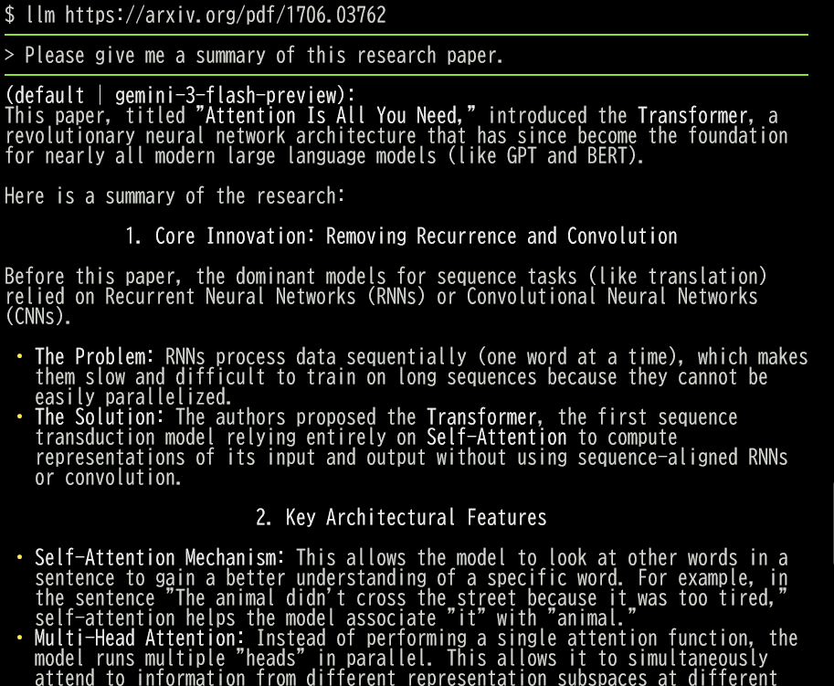
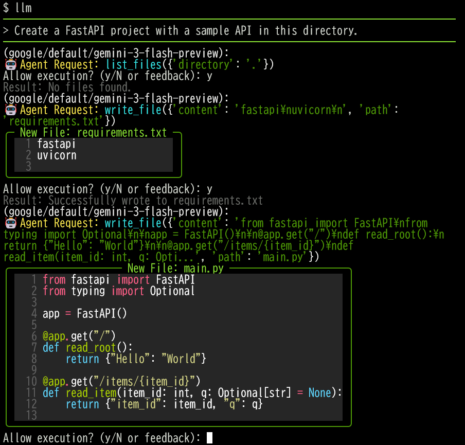

# llm-cli: A Unified Command-Line Interface for Multiple LLMs

`llm-cli` is a powerful and versatile command-line tool that provides a unified interface for interacting with various Large Language Models (LLMs). It supports services from Google (Gemini), OpenAI, Anthropic (Claude), xAI (Grok), and **local LLMs via Ollama**, allowing you to seamlessly switch between providers and leverage their unique capabilities right from your terminal using a single command: `llm`.


## Screenshots

### 📄 PDF Analysis (Multimodal)

Demonstrating how the system loads the "Attention is All You Need" paper PDF and explains its key points.



### 🤖 Agent Mode & Tool Use

The AI can use tools like `google_search` or `search_arxiv` to find real-time information or `execute_command` to run various commands. **Agent Mode is enabled by default**, allowing the AI to autonomously help with your tasks.



## Features

-   **Unified Interface**: Access Gemini, OpenAI, Claude, Grok, and **Ollama** through a single `llm` command.
-   **Local LLM Support (Ollama)**: Use models locally without cloud API costs or privacy concerns.
-   **Interactive Chat Mode**: A REPL-style interface with rich syntax highlighting and Markdown rendering.
-   **Agent Mode (Always On)**: Autonomous task execution. The AI can manage files, execute shell commands, search the web, and **dynamically attach media files**.
-   **Mandatory Reasoning (Chain-of-Thought)**: All tools require the AI to provide a `thought` parameter, explaining *why* it is calling a specific tool. This improves transparency and agent reliability.
-   **Academic Research Support**: Built-in `search_arxiv` tool to search for papers, read abstracts, and automatically fetch PDFs for analysis.
-   **Plugin-based Tool Architecture**: Easily extend the agent's capabilities by adding new tool modules.
-   **Distributed Agent via MCP**: Support for **Model Context Protocol (MCP)**. You can connect to remote `llm-cli` instances via SSH and let the LLM manage files or run tests on a remote server as if they were local tools.
-   **OpenAI-Compatible Custom Endpoints**: Use local LLMs (via Ollama, vLLM, etc.) or other OpenAI-compatible services by specifying a custom `api_url` in the configuration.
-   **User-Driven Context Management (Checkpointing)**: Manually trigger `/checkpoint` to summarize the conversation and clear history.
-   **Multimodal Input & Support**:
    -   **Manual Attachment**: Use the `/attach <path>` command mid-session to inject images, PDFs, videos, or audio.
    -   **Autonomous Attachment**: Agents can use the `attach_file` or `fetch_url` tools to bring media files into the context when needed.
    -   **Gemini**: Text, local images, PDFs, **Audio**, and **Video**.
    -   **OpenAI / Claude / Grok**: Text and local images (PDFs are processed as text/Base64).
-   **URL Support**: Directly pass website URLs to analyze their content. (Includes automatic web scraping and multimodal injection for PDFs/Images).
-   **Safe Execution**: Includes a **Diff Preview** for file changes and asks for user confirmation before executing any tool (Human-in-the-Loop).
-   **Security Guardrails**: Whitelist-based command validation protects against command injection and dangerous operations.
-   **One-Shot Execution**: Pipe input from other commands or pass prompts as arguments.
-   **Smart Log Management**: Automatically rotates and trims chat logs.
-   **Simple Configuration**: Interactive setup via `llm-cli-config`.

## Built-in Tools

The AI agent comes equipped with the following tools:

| Tool | Description |
| :--- | :--- |
| `execute_command` | Execute shell commands (validated against a security whitelist). |
| `list_files` | List files in a directory to explore the project structure. |
| `read_file` | Read content from a text file (with optional line range). |
| `write_file` | Create or update a file. |
| `google_search` | Search the web for real-time information. |
| `fetch_url` | Fetch raw HTML or media files (images/PDFs) from a URL. |
| `fetch_web_text` | Fetch a URL and extract clean text content (token-efficient). |
| `search_arxiv` | Search for academic papers on arXiv. |
| `attach_file` | Manually/Autonomously inject a file into the conversation context. |

## Security

`llm-cli` implements strict security guardrails to protect against command injection and dangerous operations:

### Command Execution Guardrails

All shell commands executed through the AI agent (`execute_command` tool) and user-initiated commands (`!command`) are validated against a **whitelist** of safe commands before execution.

**Default Allowed Commands**: `ls`, `cat`, `grep`, `find`, `git`, `python`, `npm`, `pip`, `curl`, and many other read-only or low-risk commands. See `llm_cli/security/command_validator.py` for the complete list.

**Blocked Patterns**:
- Command chaining (`&&`, `||`, `;`)
- Pipes and redirects (`|`, `>`, `<`)
- Command substitution (`` ` ``, `$()`)
- Dangerous operations (e.g., `rm -rf`, `mkfs`, `dd`)
- Risky subcommands (e.g., `git push`, `pip install`, `tar -x`)

**MCP Server Protection**: MCP server commands loaded from config files are also validated against a separate whitelist.

### Configuration

You can customize the allowed commands in `~/.config/llm_cli/config.toml`:

```toml
[security]
# Additional commands to allow beyond the default whitelist
allowed_commands = [
    "custom_script",
    "special_tool"
]

# Additional commands allowed for MCP server spawning
allowed_mcp_commands = [
    "custom_mcp_server"
]

# WARNING: Setting this to true disables protection against shell injection
# Only enable if you fully understand the security implications
allow_dangerous_patterns = false
```

**Important**: These guardrails provide defense-in-depth but do not replace user vigilance. Always review commands before approving execution.

## Installation

Ensure you have Python 3.11 or newer.

```bash
# Clone the repository
git clone https://github.com/yosh95/llm-cli.git

# Navigate to the directory
cd llm-cli

# Install the package
pip install .

# Optional: Install MCP support
pip install ".[mcp]"
```

## Quick Start

Before using the tool, run the interactive setup script to configure your API keys:

```bash
llm-cli-config
```

## Usage

### 1. Research Automation (Example)
Search for papers, find the best one, and summarize its contributions in one command:
```bash
llm "Search arXiv for 'Direct Preference Optimization', pick the most relevant paper, and summarize its key contributions."
```

### 2. Interactive Chat
Simply type `llm` to start an interactive session:
```bash
llm
```

### 3. One-Shot Prompts and Piping
```bash
# Direct prompt
llm "What is the capital of France?"

# Analyze code from a pipe
cat main.py | llm "Explain this code"

# Analyze a local file or URL
llm "Summarize this paper" https://arxiv.org/pdf/1706.03762.pdf
```

## Command-Line Options

-   `-p, --provider <provider>`: Specify the provider (`google`, `openai`, `anthropic`, `xai`, `ollama`).
-   `-m, --model <alias>`: Specify the model alias (e.g., `pro`, `flash`, `gpt4o`, `opus`, `gemma`).
-   `-t, --tools <tool_name>`: Enable specific tools.
-   `-s, --stdout`: Print the response directly to stdout and exit.
-   `--raw`: Disable Markdown rendering in the terminal.
-   `-d, --debug`: Enable live debug mode.
-   `--mcp`: Enable Model Context Protocol (MCP) integration.
-   `--mcp-server`: Run `llm-cli` as an MCP server.
-   `--no-system-prompt`: Disable the configured system prompt.

## In-Chat Commands

-   `/<provider>`: Switch provider instantly (`/google`, `/openai`, `/anthropic`, `/xai`, `/ollama`).
-   `/<alias>`: Switch model within the current provider (e.g., `/pro`, `/gpt4o`, `/opus`, `/gemma`).
-   `/models` (or `/m`): List available models and their aliases.
-   `/info` (or `/i`): Show current session info (provider, model, tools, etc.).
-   `/tools [on|off]`: Show or toggle tool status.
-   `/checkpoint` (or `/cp`): Summarize progress and clear conversation history.
-   `/attach <path>`: Manually attach a file (Image, PDF, Audio, Video).
-   `/dump`: Dump conversation history as a JSON object.
-   `/raw`: Show the raw conversation text.
-   `/clear` (or `/c`): Clear conversation history.
-   `/debug` (or `/d`): Toggle live debug mode.
-   `!command`: Execute a local shell command.
-   `/help` (or `/h`): Show full command list.
-   `/quit` (or `/q`): Exit.

## Plugin Architecture: Adding New Tools

`llm-cli` uses a decorator-based plugin system. All tools automatically require a `thought` parameter to ensure the AI explains its reasoning.

Example (`llm_cli/modules/tools/weather.py`):
```python
from llm_cli.modules.tool_registry import tool

@tool(
    name="get_weather",
    description="Get current weather for a city.",
    parameters={
        "type": "object",
        "properties": {
            "city": {"type": "string", "description": "The city name."}
        },
        "required": ["city"]
    }
)
def get_weather(city: str) -> dict:
    return {"weather": "sunny", "temperature": "25C"}
```

## Model Context Protocol (MCP) Support

`llm-cli` can act as both an MCP client and an MCP server.

### 1. Remote Development via SSH
Add the following to your `~/.config/llm_cli/config.toml`:

```toml
[[mcp_servers]]
name = "my_remote_box"
command = "ssh"
args = ["user@remote-host", "python3", "-m", "llm_cli.apps.mcp_server"]
```

### 2. Running as an MCP Server
```bash
llm --mcp-server
```

### 3. GitHub MCP Server Integration (via Docker)
You can connect the official GitHub MCP server to give your AI agent powers to read repositories, manage issues, and analyze code.

Add the following to your `~/.config/llm_cli/config.toml`:

```toml
[[mcp_servers]]
name = "github"
command = "docker"
args = [
  "run",
  "-i",
  "--rm",
  "-e", "GITHUB_PERSONAL_ACCESS_TOKEN=YOUR_GITHUB_TOKEN",
  "-e", "GITHUB_LOCKDOWN_MODE=1",
  "ghcr.io/github/github-mcp-server"
]
```

Then run `llm-cli` with the `--mcp` flag:
```bash
llm --mcp
```

## Utility Scripts

-   `llm-cli-config`: Interactive configuration tool.
-   `*-models`: List available models for each provider (e.g., `ollama-models`).
-   `translate-json`: A utility to translate specific keys in a JSON file.

## License

This project is licensed under the [Apache License 2.0](LICENSE).

--------

# llm-cli: 複数LLM対応 統合コマンドラインインターフェース

`llm-cli` は、多様な大規模言語モデル（LLM）と対話するための、強力で汎用性の高いコマンドラインツールです。Google (Gemini)、OpenAI、Anthropic (Claude)、xAI (Grok) に加え、**Ollama を介したローカルLLM** をサポートしており、単一の `llm` コマンドだけでプロバイダをシームレスに切り替えながら、各モデルの機能をターミナルから直接活用できます。

## スクリーンショット

### 📄 PDF解析（マルチモーダル）
"Attention is All You Need" 論文のPDFを読み込み、その要点を解説するデモ。


### 🤖 エージェントモード & ツール利用
AIは `google_search` や `search_arxiv` を使ってリアルタイム情報を検索したり、`execute_command` で任意のコマンドを実行したりできます。**エージェントモードはデフォルトで有効**になっており、AIが自律的にタスクをサポートします。


## 主な機能

-   **統合インターフェース**: `llm` コマンド一つで Gemini, OpenAI, Claude, Grok, **Ollama** にアクセス可能。
-   **ローカルLLM対応 (Ollama)**: クラウドAPIの料金を気にせず、プライバシーを保ったままモデルを利用できます。
-   **対話型チャットモード**: シンタックスハイライトとMarkdownレンダリングに対応したREPL形式のインターフェース。
-   **エージェントモード（常時有効）**: 自律的なタスク実行。ファイルの管理、シェルコマンド実行、Web検索、**メディアファイルの動的添付**が可能です。
-   **思考プロセスの義務化 (Chain-of-Thought)**: すべてのツール実行において、AIに `thought` パラメータ（なぜそのツールを使うのかという理由）の提供を強制します。これにより、エージェントの推論の透明性と信頼性が向上します。
-   **先行研究調査の自動化**: `search_arxiv` ツールを搭載。特定のトピックに関する最新論文の検索から、アブストラクトの確認、PDFの自動取得と解析までをシームレスに行えます。
-   **プラグインベースのツール設計**: デコレータを使用したプラグインシステムにより、新しいツールの追加が容易です。
-   **Distributed Agent via MCP**: **Model Context Protocol (MCP)** をサポート。SSH経由でリモートの `llm-cli` インスタンスに接続し、リモートサーバー上のファイル操作やテスト実行をローカルツールのように行えます。
-   **OpenAI互換カスタムエンドポイント**: `api_url` を設定することで、ローカルLLM（Ollama, vLLM 等）やその他のOpenAI互換サービスを利用可能。
-   **ユーザー主導の履歴管理（チェックポイント機能）**: `/checkpoint` コマンドで会話の要約を作成し、履歴をリセットしてコンテキストを整理。
-   **マルチモーダル対応**:
    -   **手動添付**: `/attach <path>` コマンドで画像、PDF、音声、動画を会話の途中から注入。
    -   **自律添付**: エージェントが必要に応じてツールを使い、メディアファイルをコンテキストに読み込みます。
    -   **Gemini**: テキスト、ローカル画像、PDF、**音声**、**動画**をサポート。
    -   **OpenAI / Claude / Grok**: テキスト、ローカル画像をサポート（PDFはテキストまたはBase64として処理）。
-   **URL直接指定**: ウェブサイトのURLを渡すことで、内容を自動的に解析可能（自動スクレイピング、PDF/画像のマルチモーダル注入を含む）。
-   **安全な実行**: ファイル変更時の **Diffプレビュー** 表示と、ツール実行前のユーザー確認（Human-in-the-Loop）。
-   **セキュリティガードレール**: ホワイトリストベースのコマンド検証により、コマンドインジェクションや危険な操作を防止。
-   **ワンショット実行**: 他のコマンドからのパイプ入力や、引数としてのプロンプト実行に対応。
-   **ログ管理**: チャットログの自動ローテーションとトリミング機能を搭載。
-   **簡単設定**: `llm-cli-config` による対話形式のセットアップ。

## 組み込みツール一覧

AIエージェントは以下のツールを標準で備えています：

| ツール名 | 説明 |
| :--- | :--- |
| `execute_command` | シェルコマンドを実行（ホワイトリストによる安全検証付き）。 |
| `list_files` | ディレクトリ内のファイル一覧を表示し、プロジェクト構造を把握。 |
| `read_file` | テキストファイルの内容を読み取り（行指定可能）。 |
| `write_file` | ファイルを新規作成または更新。 |
| `google_search` | Google検索を使用してリアルタイムの情報を取得。 |
| `fetch_url` | 指定したURLから生のHTMLやメディアファイル（画像/PDF等）を取得。 |
| `fetch_web_text` | URLから本文テキストのみを抽出。トークンを節約しつつ情報を収集。 |
| `search_arxiv` | arXivから学術論文を検索。 |
| `attach_file` | ファイルを会話のコンテキストに注入。 |

## セキュリティ

`llm-cli` はコマンドインジェクションや危険な操作を防止するため、厳格なセキュリティガードレールを実装しています：

### コマンド実行ガードレール

AIエージェント (`execute_command` ツール) およびユーザーが直接実行するコマンド (`!command`) は、実行前に安全なコマンドの**ホワイトリスト**に対して検証されます。

**デフォルトで許可されているコマンド**: `ls`, `cat`, `grep`, `find`, `git`, `python`, `npm`, `pip`, `curl` など、読み取り専用または低リスクのコマンド。完全なリストは `llm_cli/security/command_validator.py` を参照してください。

**ブロックされるパターン**:
- コマンドチェーン (`&&`, `||`, `;`)
- パイプとリダイレクト (`|`, `>`, `<`)
- コマンド置換 (`` ` ``, `$()`)
- 危険な操作 (例: `rm -rf`, `mkfs`, `dd`)
- 危険なサブコマンド (例: `git push`, `pip install`, `tar -x`)

**MCP サーバー保護**: 設定ファイルから読み込まれる MCP サーバーコマンドも、別のホワイトリストに対して検証されます。

### 設定

`~/.config/llm_cli/config.toml` で許可するコマンドをカスタマイズできます：

```toml
[security]
# デフォルトのホワイトリストに追加で許可するコマンド
allowed_commands = [
    "custom_script",
    "special_tool"
]

# MCP サーバー起動で許可する追加のコマンド
allowed_mcp_commands = [
    "custom_mcp_server"
]

# 警告: これを true に設定すると、シェルインジェクションに対する保護が無効になります
# セキュリティへの影響を十分に理解した上でのみ有効にしてください
allow_dangerous_patterns = false
```

**重要**: これらのガードレールは多層防御を提供しますが、ユーザーの注意を置き換えるものではありません。実行を承認する前に常にコマンドを確認してください。

## インストール

Python 3.11 以上が必要です。

```bash
# リポジトリをクローン
git clone https://github.com/yosh95/llm-cli.git

# ディレクトリに移動
cd llm-cli

# パッケージをインストール
pip install .

# オプション: MCPサポートをインストール
pip install ".[mcp]"
```

## クイックスタート

最初に使用する前に、セットアップスクリプトを実行してAPIキーを設定してください：

```bash
llm-cli-config
```

## 使い方

### 1. 研究調査の自動化（例）
特定のトピックに関する論文を探し、最適なものを選んで日本語でまとめさせることができます。
```bash
llm "arXivで 'Direct Preference Optimization' に関する論文を探して、最も関連性の高いものを選び、その主要な貢献をまとめて。"
```

### 2. インタラクティブ・チャット
単に `llm` と打つだけでセッションが開始されます：
```bash
llm
```

### 3. ワンショットプロンプトとパイプ利用
```bash
# 直接プロンプトを実行
llm "フランスの首都は？"

# パイプからコードを解析
cat main.py | llm "このコードを解説して"

# ローカルファイルやURLを解析
llm "この論文を要約して" https://arxiv.org/pdf/1706.03762.pdf
```

## コマンドライン・オプション

-   `-p, --provider <provider>`: プロバイダを指定 (`google`, `openai`, `anthropic`, `xai`, `ollama`)。
-   `-m, --model <alias>`: モデルのエイリアスを指定 (例: `pro`, `flash`, `gpt4o`, `opus`, `gemma`)。
-   `-t, --tools <tool_name>`: 特定のツールを有効化。
-   `-s, --stdout`: 応答を直接標準出力に表示して終了。
-   `--raw`: Markdownレンダリングを無効化。
-   `-d, --debug`: ライブデバッグモードを有効化。
-   `--mcp`: MCP（Model Context Protocol）連携を有効化。
-   `--mcp-server`: `llm-cli` を MCP サーバーとして起動。
-   `--no-system-prompt`: 設定されたシステムプロンプトを無効化。

## チャット内コマンド

-   `/<provider>`: プロバイダを即座に切り替え (`/google`, `/openai`, `/anthropic`, `/xai`, `/ollama`)。
-   `/<alias>`: 現在のプロバイダ内でモデルを切り替え (例: `/pro`, `/gpt4o`, `/opus`, `/gemma`)。
-   `/models` (または `/m`): 利用可能なモデルとエイリアスを表示。
-   `/info` (または `/i`): 現在のセッション情報（プロバイダ、モデル、ツール等）を表示。
-   `/tools [on|off]`: ツールの有効・無効を切り替え。
-   `/checkpoint` (または `/cp`): 進捗を要約し、会話履歴をクリア。
-   `/attach <path>`: ファイル（画像、PDF、音声、動画）を手動で添付。
-   `/dump`: 会話履歴をJSON形式でダンプ。
-   `/raw`: 生の会話テキストを表示。
-   `/clear` (または `/c`): 会話履歴をクリア。
-   `/debug` (または `/d`): ライブデバッグモードのON/OFF切り替え。
-   `!command`: ローカルのシェルコマンドを実行。
-   `/help` (または `/h`): 全コマンドリストを表示。
-   `/quit` (または `/q`): 終了。

## プラグイン・アーキテクチャ: ツールの追加

`llm-cli` はデコレータベースのプラグインシステムを採用しています。登録されたすべてのツールには、AIによる推論を明示するための `thought` パラメータが自動的に付与されます。

例 (`llm_cli/modules/tools/weather.py`):
```python
from llm_cli.modules.tool_registry import tool

@tool(
    name="get_weather",
    description="指定した都市の現在の天気を取得します。",
    parameters={
        "type": "object",
        "properties": {
            "city": {"type": "string", "description": "都市名。"}
        },
        "required": ["city"]
    }
)
def get_weather(city: str) -> dict:
    return {"weather": "sunny", "temperature": "25C"}
```

## MCP (Model Context Protocol) サポート

`llm-cli` は MCP クライアントとしてもサーバーとしても動作します。

### 1. SSH経由のリモート開発
`~/.config/llm_cli/config.toml` に以下を追加します：

```toml
[[mcp_servers]]
name = "my_remote_box"
command = "ssh"
args = ["user@remote-host", "python3", "-m", "llm_cli.apps.mcp_server"]
```

### 2. MCPサーバーとして実行
```bash
llm --mcp-server
```

### 3. GitHub MCP Server との連携 (Docker利用)
GitHub公式のMCPサーバーを連携させることで、AIエージェントにリポジトリの読み書き、Issueの管理、コード解析などの権限を与えることができます。

`~/.config/llm_cli/config.toml` に以下のエントリを追加します：

```toml
[[mcp_servers]]
name = "github"
command = "docker"
args = [
  "run",
  "-i",
  "--rm",
  "-e", "GITHUB_PERSONAL_ACCESS_TOKEN=あなたのGitHubトークン",
  "-e", "GITHUB_LOCKDOWN_MODE=1",
  "ghcr.io/github/github-mcp-server"
]
```

その後、`--mcp` フラグを付けて `llm-cli` を起動します：
```bash
llm --mcp
```

## ユーティリティ・スクリプト

-   `llm-cli-config`: 対話型設定ツール。
-   `*-models`: 各プロバイダの利用可能なモデルリスト (例: `ollama-models`)。
-   `translate-json`: JSONファイル内の特定のキーを翻訳するユーティリティ。

## License

[Apache License 2.0](LICENSE) で提供されています。
