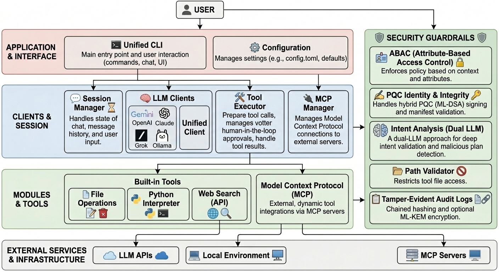
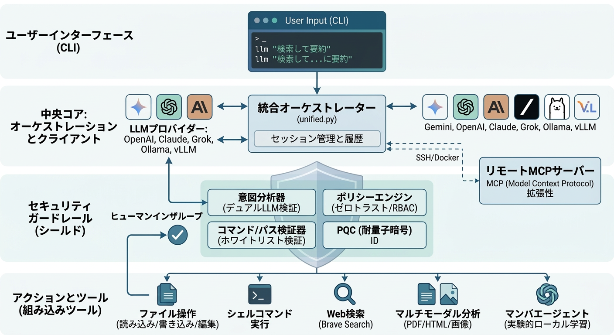

# llm-cli: A Unified Command-Line Interface for Multiple LLMs


## 📄 Technical Reports (Pre-prints)
Detailed architectural insights and security analysis are available in the following reports:
- **[Post-Quantum AI Governance: Context-Adaptive Security Scaling and Bi-directional Verification for AI Agents](paper/pqc/pqc_in_ai_agents.pdf)**
- **[Zero-Trust Tool Orchestration: Securing Autonomous Agents via Asymmetric Identity and Dual-LLM Intent Analysis](paper/zero-trust/llm_cli_zero_trust.pdf)**
- **[Autonomous Guardrails: Multi-Layered Security for LLM Command-Line Interfaces](paper/guardrail/llm_cli_tech_report.pdf)**

[English] | [日本語](#japanese-description)

---

`llm-cli` is a powerful and versatile command-line tool that provides a unified interface for interacting with various Large Language Models (LLMs). It supports services from Google (Gemini), OpenAI, Anthropic (Claude), xAI (Grok), and **local LLMs via Hugging Face Transformers**, allowing you to seamlessly switch between providers and leverage their unique capabilities right from your terminal using a single command: `llm`.

<p align="center">
  
</p>

## TL;DR (Quick Start)
- **Install**: `pip install .`
- **Optional**: `pip install ".[huggingface]"` for local LLM support.
- **Configure**: `llm-cli-config` (Set API keys).
- **Chat**: `llm` (Agent mode is ON by default).
- **One-shot**: `llm "Summarize this" file.pdf`.
- **Switch**: `/p gemini` or `/m image`.
- **Safe**: Diff preview + Human-in-the-loop approval for all tools.

## Key Features

-   **Unified Interface**: Access Gemini, OpenAI, Claude, Grok, and **Hugging Face (Local)** through a single `llm` command.
-   **Local LLM Support**: Use models locally via Hugging Face Transformers without external API servers, cloud costs or privacy concerns.
-   **Autonomous Agent**: The AI can manage files, execute shell commands, search the web, and **dynamically attach media files**.
-   **Multimodal Input & Output**:
    -   **Input**: Manual (`/attach`) or autonomous (`read_pdf_from_url`, etc.) attachment of Images, PDFs, Audio, and Video.
    -   **Output**: Generate images (DALL-E 3, Grok-Imagine, Gemini) and videos (Veo, Sora) mid-conversation.
-   **Distributed Agent via MCP**: Support for **Model Context Protocol**. Connect to remote instances via SSH to manage files or run tests as if they were local.
-   **URL Support**: Directly pass website URLs to analyze content with automatic scraping.
-   **Safe Execution**: Whitelist-based command validation, **Diff Preview** for file changes, and **Human-in-the-Loop** confirmation.
-   **Advanced Security**: Hybrid PQC (Post-Quantum Cryptography) signatures, Zero-Trust orchestration, and Dual-LLM Intent Analysis.

## Screenshots

### 🤖 Autonomous Agent & Tool Use
The AI agent autonomously uses tools to perform complex tasks, such as understanding project structures before editing code.

<p align="center">
  
</p>

## Installation & Setup

### 1. Installation
Ensure you have Python 3.11 or newer.
```bash
git clone https://github.com/yosh95/llm-cli.git
cd llm-cli
pip install .
# Optional: Install Mamba support (Experimental)
pip install ".[mamba]"
```

### 2. Configuration
Run the interactive setup to configure your API keys:
```bash
llm-cli-config
```
Alternatively, use environment variables:
```bash
export OPENAI_API_KEY="sk-..."
export ANTHROPIC_API_KEY="sk-ant-..."
export GOOGLE_API_KEY="AIza..."
export XAI_API_KEY="xai-..."
```

## Usage & Commands

### 1. Interactive Chat
Simply type `llm` to start an interactive session:
```bash
llm
```

### 2. One-Shot Prompts and Piping
```bash
# Direct prompt
llm "What is the capital of France?"

# Analyze code from a pipe
cat main.py | llm "Explain this code"

# Analyze a local file or URL
llm "Summarize this paper" https://arxiv.org/pdf/1706.03762.pdf
```

### 3. Template Management
Define frequently used prompts in `~/.config/llm_cli/config.toml`:
```toml
[templates]
proofread = "Proofread the following text for grammar and clarity:"
```
Use them in chat: `> /t proofread`.

### 4. CLI Options
- `-p, --provider <provider>`: Specify provider (`google`, `openai`, `anthropic`, `xai`, `huggingface`).
- `-m, --model <alias>`: Specify model alias (e.g., `pro`, `flash`, `mini`, `opus`).
- `-s, --stdout`: Print response directly to stdout and exit.
- `--mcp`: Enable MCP integration.
- `--session <path>`: Load a saved session JSON.

### 5. In-Chat Commands
- `/p`, `/m`: Switch provider/model.
- `/t`: Insert a template.
- `/i`: Show session info.
- `/cp`: Checkpoint (Summarize and clear history).
- `/attach <path>`: Manually attach a file.
- `/save` / `/load`: Manage conversation history.
- `/q`: Exit. (Or use **Ctrl+C** / **Ctrl+D** anytime).

## Built-in Tools

| Tool | Description |
| :--- | :--- |
| `list_files_in_directory` | List files in a directory tree. |
| `search_files` | Search for a regex pattern in files. |
| `read_file_content` | Read content from a text file. |
| `execute_shell_command` | Execute shell commands (validated against whitelist). |
| `edit_file` | Edit a file with Diff preview. |
| `create_or_overwrite_file` | Create a new file. |
| `read_pdf_content` | Read a local PDF file. |
| `search_web` | Search the web using Brave Search. |
| `read_html_from_url` | Fetch a URL and convert it to Markdown. |
| `read_pdf_from_url` | Download and extract text from a PDF URL. |

## Security & Guardrails

`llm-cli` implements strict security guardrails to protect against command injection and dangerous operations:

### 🛡️ Secure MCP Orchestration (Zero Trust)
- **Asymmetric Identity**: Uses **RS256** signatures for tool execution. No shared secrets.
- **Post-Quantum Cryptography (PQC)**: Hybrid signatures (RSA + ML-DSA) ensure security against future quantum threats.
- **Context-Adaptive Security Scaling (CASS)**: Dynamically scales security levels based on tool risk.
- **Audit Logging**: Tamper-evident logs with chained hashing and Merkle Root protection.

### 🧠 Intent Analyzer (Dual-LLM)
Uses a secondary, lightweight LLM (Verifier) to audit the actions of the main agent in real-time. If the agent's tool call doesn't match the user's intent (e.g., user asks to "read" but agent tries to "delete"), the execution is blocked.

### 🛡️ Command Validation & Resource Limits
- **Whitelist**: All commands are checked against a safe whitelist (e.g., `ls`, `cat`, `grep`).
- **Path Guardrails**: Restricts operations to `allowed_paths` defined in your config.
- **Human-in-the-Loop**: All destructive actions **must be approved by a human**.
- **Limits**: Default 300s timeout, 1GB memory limit, and 10,000 character output truncation.

## Advanced Features

### 🔌 Plugin Architecture: Adding New Tools
`llm-cli` uses a decorator-based plugin system. All tools automatically require an `explanation` parameter.
```python
@tool(name="get_weather", description="Get weather", parameters={...})
def get_weather(city: str) -> dict:
    return {"weather": "sunny"}
```

### 🌐 Model Context Protocol (MCP) Support
Connect to remote servers via SSH or integrate with services like GitHub via Docker.
```toml
[[mcp_servers]]
name = "remote"
command = "ssh"
args = ["user@host", "python3", "-m", "llm_cli.apps.mcp_server"]
```

### 🐍 Mamba Agent (Experimental)
A lightweight, local agent powered by the Mamba architecture. Supports **Mentor-Led Evolution** where it learns from critiques provided by a larger model (e.g., via Hugging Face).

### 💡 Power User Tips
- **Backgrounding (`Ctrl+Z`)**: Suspend the session to perform shell operations, then use `fg` to return.
- **External Editor (`Ctrl+X, Ctrl+E`)**: Open the current prompt in `vim` or `nano` for complex editing.

## License
Licensed under [Apache License 2.0](LICENSE).

---

<a name="japanese-description"></a>
# llm-cli: 複数LLM対応 統合コマンドラインインターフェース

## 📄 技術レポート (Pre-prints)
詳細な解説については、以下のレポート（英語）を参照してください。
- **[Post-Quantum AI Governance: AIエージェントのための動的セキュリティスケーリング](paper/pqc/pqc_in_ai_agents.pdf)**
- **[Zero-Trust Tool Orchestration: 非対称アイデンティティとDual-LLM意図解析](paper/zero-trust/llm_cli_zero_trust.pdf)**
- **[Autonomous Guardrails: LLM-CLIのための多層防御セキュリティ](paper/guardrail/llm_cli_tech_report.pdf)**

`llm-cli` は、Google (Gemini), OpenAI, Anthropic (Claude), xAI (Grok), および **Hugging Face を介したローカルLLM** を一元的に操作できるコマンドラインツールです。

<p align="center">
  
</p>

## クイックスタート
- **インストール**: `pip install .`
- **オプション**: `pip install ".[huggingface]"` (ローカルLLMサポート)
- **初期設定**: `llm-cli-config` (APIキーの設定)
- **チャット**: `llm` (デフォルトでエージェントモード有効)
- **ワンショット**: `llm "要約して" file.pdf`
- **切り替え**: `/p gemini` または `/m image`
- **安全**: Diffプレビューと人間による承認（Human-in-the-loop）を徹底。

## 主な機能
- **統合インターフェース**: `llm` コマンド一つで主要なクラウドLLMとローカルLLMにアクセス。
- **ローカルLLM対応**: Hugging Face Transformers を利用し、外部サーバー不要でローカルモデルを実行。
- **自律型エージェント**: ファイル操作、シェル実行、Web検索、メディア添付を自律的に実行。
- **マルチモーダル入出力**: 画像、PDF、音声、動画の入力をサポート。画像・動画生成も可能。
- **Distributed Agent via MCP**: Model Context Protocol により、リモートサーバーの操作もローカル同様に可能。
- **URL解析**: WebサイトのURLを渡すだけで、内容をスクレイピングして解析。
- **堅牢なセキュリティ**: PQC（耐量子暗号）署名、Zero-Trust、Dual-LLMによる意図解析。

## スクリーンショット
### 🤖 自律型エージェントのツール実行
AIがディレクトリ構造を確認し、コードを読み取ってから作業を行う様子。

<p align="center">
  
</p>

## インストールと設定

### 1. インストール
Python 3.11以上が必要です。
```bash
git clone https://github.com/yosh95/llm-cli.git
cd llm-cli
pip install .
# オプション: Mambaサポート（実験的）
pip install ".[mamba]"
```

### 2. APIキーの設定
対話型スクリプトを実行：
```bash
llm-cli-config
```
または環境変数を使用：
```bash
export OPENAI_API_KEY="sk-..."
export GOOGLE_API_KEY="AIza..."
```

## 使用方法とコマンド

### 1. 対話型チャット
```bash
llm
```

### 2. ワンショット実行とパイプ
```bash
# 直接実行
llm "フランスの首都は？"
# パイプ入力
cat main.py | llm "解説して"
# URL解析
llm "内容を要約して" https://arxiv.org/pdf/1706.03762.pdf
```

### 3. テンプレート管理
`config.toml` に定義したテンプレートを `/t` で呼び出せます。

### 4. コマンドラインオプション
- `-p, --provider`: プロバイダ指定。
- `-m, --model`: モデル指定。
- `-s, --stdout`: 結果を標準出力に表示して終了。
- `--mcp`: MCP統合を有効化。

### 5. チャット内コマンド
- `/p`, `/m`: プロバイダ/モデル切り替え。
- `/t`: テンプレート挿入。
- `/cp`: チェックポイント（履歴要約とクリア）。
- `/attach <path>`: ファイル添付。
- `/q`: 終了（**Ctrl+C** / **Ctrl+D** も可）。

## 組み込みツール一覧
| ツール | 説明 |
| :--- | :--- |
| `list_files_in_directory` | ファイル一覧を表示。 |
| `search_files` | 正規表現でファイルを検索。 |
| `read_file_content` | テキストファイルを読み込み。 |
| `execute_shell_command` | シェルコマンドを実行（検証済みのみ）。 |
| `edit_file` | Diff表示付きのファイル編集。 |
| `create_or_overwrite_file` | ファイルの新規作成。 |
| `search_web` | Brave SearchによるWeb検索。 |
| `read_html_from_url` | URLをMarkdownとして取得。 |

## セキュリティ

### 🛡️ 安全なMCPオーケストレーション（Zero Trust）
- **非対称鍵認証**: RS256署名による実行主体確認。
- **耐量子暗号 (PQC)**: RS256 + ML-DSA のハイブリッド署名。
- **監査ログ**: ハッシュ連鎖とMerkle Rootによる改ざん検知。

### 🧠 Intent Analyzer (Dual-LLM)
メインエージェントの行動を別の軽量LLMがリアルタイムで監査。ユーザーの意図に反する破壊的行為を未然に防ぎます。

### 🛡️ ガードレールと制限
- **ホワイトリスト**: `ls`, `cat` 等の安全なコマンドのみ許可。
- **Human-in-the-Loop**: すべての書き込み・実行操作は**人間の承認が必要**。
- **リソース制限**: メモリ1GB、タイムアウト300秒の制限。

## アドバンスド機能

### 🔌 プラグイン: ツールの追加
デコレータを使用して簡単に新しいツールを追加可能。AIへの「説明（explanation）」提供が必須となっています。

### 🌐 MCP (Model Context Protocol)
SSH経由のリモート開発や、Docker経由のGitHub連携などをサポート。

### 🐍 Mamba Agent (実験的)
軽量なMambaアーキテクチャによるローカルエージェント。巨大モデル（Hugging Face等）による「添削（Mentor）」を通じたオンライン学習が可能。

### 💡 パワーユーザー向け
- **バックグラウンド実行 (`Ctrl+Z`)**: 一時停止してシェルに戻り、`fg` で復帰。
- **外部エディタ (`Ctrl+X, Ctrl+E`)**: `vim` 等でプロンプトを編集。

## ライセンス
[Apache License 2.0](LICENSE) に基づき公開されています。
